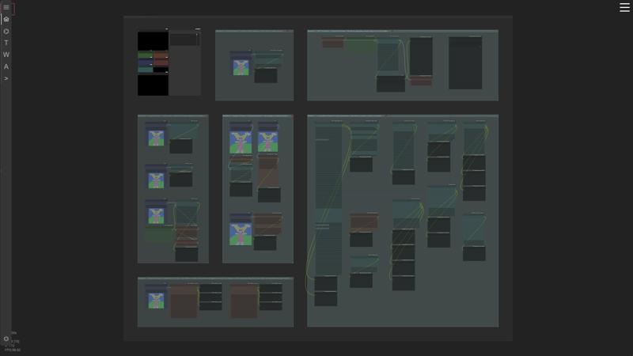
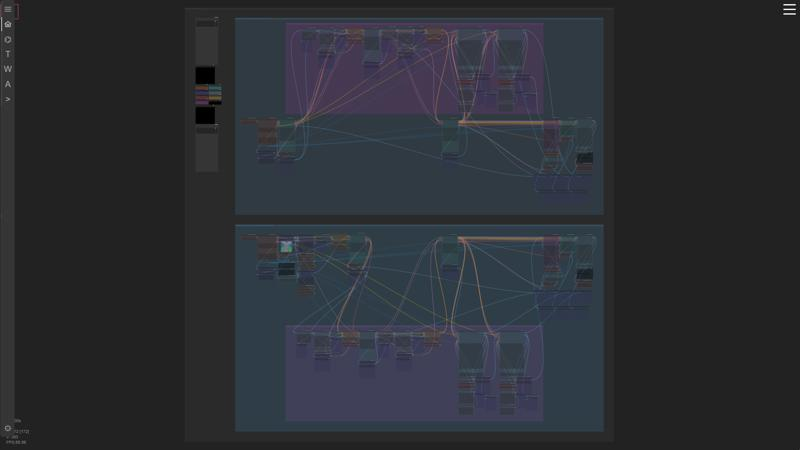
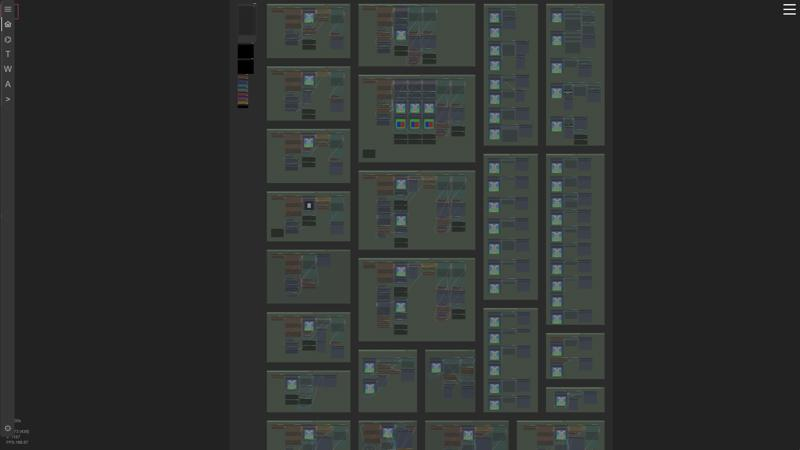
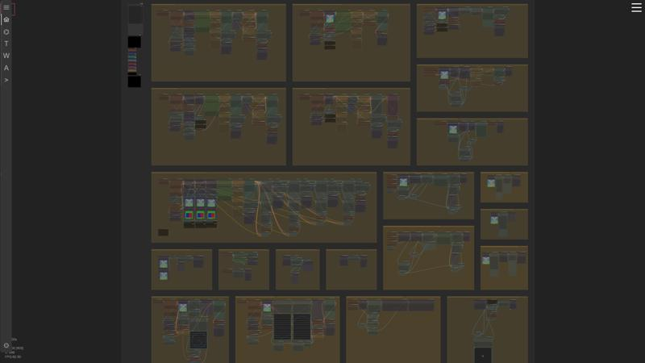
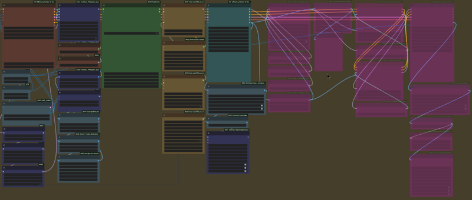

# AEmotion's ComfyUI Workflow Suite

*Updated October 1st, 2024 [outdated - here for archiving]*

## 📖 About

This suite is a collection of modules which aims to cover the entire creation process from prompts to full on animations in a neat, organized, and compact fashion.

The ultimate goal is to streamline productivity while outputting high quality content, without the need to switch back and forth between a bunch of other workflows.

All modules here are uniform and have a left-to-right, top-to-bottom flow (sequential flow), meaning they read just like a book. No nodes are hidden, there are no extravagant re-routes, and all similar or branching nodes are grouped together accordingly. I have also included a good bit of notation within the workflows themselves to answer any questions. All nodes are also color coordinated with a corresponding key in the top left corner of every module.

## ✨ What's New in v1.5

Version 1.5 is a large upgrade to this suite, with the addition of 22+ new workflows, a lot of updated text and information, updates to the latest controlnets, cleared out dated workflows, and adjusted a bunch of values and nodes for overall better results.

> [!IMPORTANT]
> **Update your Comfy UI before use to avoid running into issues.**
>
> This suite uses an older version of IPAdapter Plus (pre-V2), so **DO NOT update IPAdapter Plus**. If you have already updated, you will need to either revert your git version of IPAdapter Plus or update the IPAdapters to the V2 versions where applicable in the workflows. I may eventually update to IPAdapter Plus V2 but it is not a priority right now, especially with the release of FLUX.

Below is a brief break down of the suite and all its contents. Newly added workflows are highlighted in Green within the workflows themselves.

---

## 🎨 Module #1: Prompt Generator

You can use this module as a type of brain-storming workshop for prompting. It contains a variety of ways to generate prompts.

- LLaVA Captioner to Prompt
- GPT to Prompt
- VLM Nodes
- BLIP & WD 1.4 Tagger
- Auto-Prompters - Controlled & Random
- Ollama to Prompt

## 🖼️ Module #2: Image Generator

Used to create images from text as well as loaded images. Both text to image and image to image contain double face and hand detailers as well as triple tile upscalers for the best possible results.

- Text to Image Generation
- Image to Image Generation

## 🎭 Module #3: Compositing & Editing

This module handles a variety of tasks related to compositing and editing.

- In-Painting
- ClipSeg
- Pix2Pix
- Simple Mask
- IPAdapter Attention Masking
- IPAdapter Styler
- IPAdapter FaceID/Face Swapper
- IPAdapter Composition
- Image and Text Overlay
- Image Cropping
- Image Border Creation
- Filters, Colors, and Post-Processing
- Florence 2
- SAM2 Point Seg
- SAM2 + Florence2
- Depth Imaging
- Big Lama Remover
- Differential Diffusion
- Layer Diffusion
- IC-Light
- Alt. IC-Light
- Post Processing
- CatVTON

## 🎥 Module #4: Animation Generator

This module's aim is to provide a multitude of ways to create animations, from text, video, and images.

- Remove Video Background #1
- Remove Video Background #2
- Text to Video (AnimateDiff)
- Video to Video (AnimateDiff)
- Attention Masking & Image Composite to Video (AnimateDiff)
- In-paint Image to Video (AnimateDiff)
- Video Upscale (AnimateDiff)
- Image to Video (SVD)
- Simple Frame Interpolation
- MotionDiff & SMPL
- ContolNeXt SVD
- MimicMotion
- Image Live Portrait
- Video Live Portrait
- Advanced Live Portrait #1 - #3
- IC-Light Animated #1 & #2
- Florence2 & Sam2
- SAM2 Point Segmentation

---

## 💡 Tips & Tricks

For low-vram users or to cut down on generation times - bypass the second half of the group after the 1st Ksampler. Example below:

- The `animatediff_controlnet_checkpoint.ckpt` can be found [here](https://huggingface.co/crishhh/animatediff_controlnet/blob/main/controlnet_checkpoint.ckpt).
- For more info check [here](https://github.com/crystallee-ai/animatediff-controlnet).

---

Thanks to all the wonderful node and model creators used within this suite!

> [!WARNING]
> As always be sure to check the Github of the nodes you are downloading and to verify that you trust the developer and/or the model creators of the models you are using before use.

## ⚖️ Liability

a. You are solely responsible for any legal liability resulting from your use of these workflows.
b. The creator(s) of these workflows disclaim any responsibility for misuse or unethical use of the workflows or their outputs.
c. The creator(s) of these workflows are not liable for any damages claimed to result from the use of these workflows, including but not limited to direct, indirect, incidental, or consequential damages.

## 📞 Contact & Socials

- **Youtube**: <https://www.youtube.com/@aemotionstudio>
- **Website**: <https://aemotionstudio.org/>
- **Civitai**: <https://civitai.com/user/AEmotionStudio>
- **Github**: <https://github.com/AEmotionStudio>
